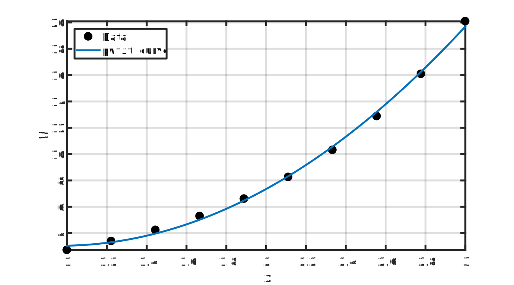
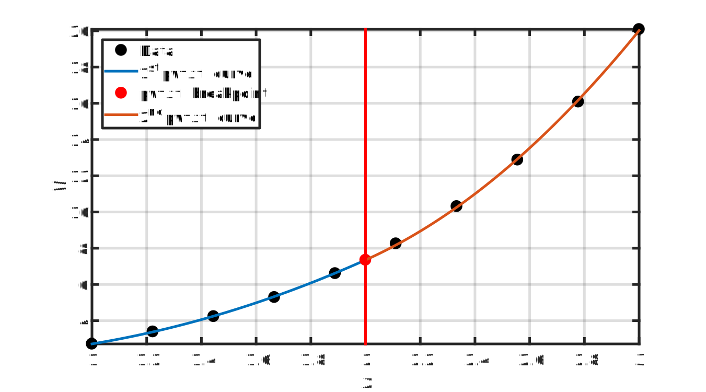
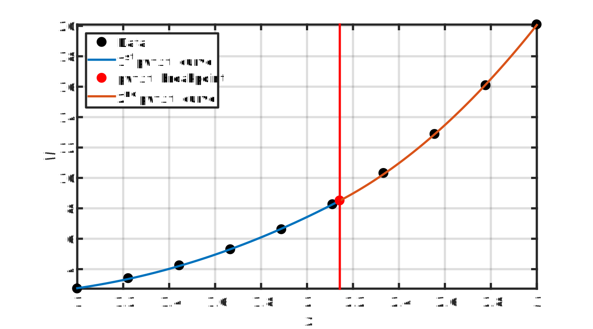
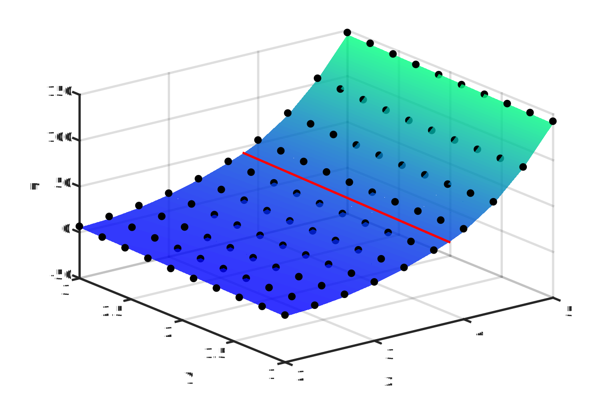

# pwfit
Fit a single or a piecewise curve/surface to data.

This MATLAB class creates a single or piecewise fit approximation for univariate or bivariate functions. 
Unlike other piecewise fit approximations, such as the [Lambda Method](https://documentation.aimms.com/_downloads/AIMMS_modeling.pdf) and [Triangle Method](https://doi.org/10.1016/j.orl.2009.09.005), this approach is not limited to 
linear approximations but allows higher order polynomial fit approximations to achieve better accuracy 
without increasing the number of breakpoints. 

The algorithm of `pwfit` utilizes the `lsqlin` function to solve a constrained least-squares curve fitting 
problem formulated using the input data, and the NLopt nonlinear optimization library to optimize the locations of the 
piecewise breakpoints. Therefore, the `pwfit` class requires the MATLAB Optimization Toolbox 
and [OPTI Toolbox](https://www.inverseproblem.co.nz/OPTI/) to be installed. 

#### Examples
For illustration purposes, take the following data that was generated using a basic exponential function, 
y(x) = exp(x), as an example:

```
xdata = [1, 1.22, 1.44, 1.67, 1.89, 2.11, 2.33, 2.56, 2.78, 3.00];
ydata = [2.72, 3.39, 4.24, 5.29, 6.61, 8.26, 10.31, 12.88, 16.08];
```
The data can be approximated using a second order polynomial function, i.e., `poly2`, by using the following command: 
```
pwfitobj = pwfit(xdata,ydata,‘poly2’);
```
This will create a `pwfit` object that can be passed to one of the `pwfit` methods, namely, `feval`, `print`, and `plot`, 
to evaluate the piecewise function at a specified point, to print the piecewise fit subfunctions, 
and to plot the piecewise fit, respectively. 

```
>> feval(pwfitobj, 2.2)

ans = 
  	9.1756 
  
>> print(pwfitobj, ‘%0.3g’)

ans = 
	1x1 cell array
	{‘4.02*xd^2 + -7.75*xd + 6.78’}
  
>> plot(pwfitobj)
```
<p align="center">
	
</p>

In order to approximate the data using a piecewise function, you will need to specify the fixed breakpoints (including the extrema) as follows:
```
pwfitobj = pwfit(xdata,ydata,‘poly2’,[1,2,3]); 
```
This results in the following piecewise fit approximation when plotted:
<p align="center">
	
</p>

To optimize the locations of the breakpoints to improve accuracy of the fit, this can be invoked as follows:
```
pwfitobj = pwfit(xdata,ydata,‘poly2’,[1,2,3],‘optimized’);
```
This results in  the following piecewise fit approximation when plotted:
<p align="center">
	
</p>

The same MATLAB syntax can be used for bivariate functions. However, the only difference is that the `Xdata`, `Ydata`, and `Zdata` are matrices, and both `Ydata` and `Zdata` are supplied to together in a cell with curly brackets. For instance:
```
x = linspace(2,5,10);
y = linspace(1,3,10);
[Xdata,Ydata] = meshgrid(x,y);
Zdata =  -sin(Ydata)^2 + exp(Xdata);
pwfitobj = pwfit(Xdata,{Ydata,Zdata},'poly21',linspace(x(1),x(end),3),'optimized');
```
This results in the following piecewise fit approximation when plotted:
<p align="center">
	
</p>

Note that the breakpoints for bivariate functions only divide the function along the x-axis. Therefore, increasing the number of breakpoints might not always improve the accuracy of the fit.  

